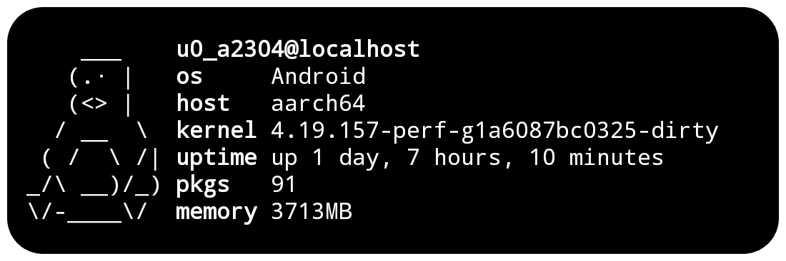

# tfetch🐧

A tiny system info script for [Termux](https://termux.dev), written in pure Bash.  
No dependencies. No noise. Just the essentials.

<p align="center">
  
</p>



## Features

- Displays basic system information:
  - Username and hostname
  - OS, architecture, kernel
  - Uptime, installed packages, memory
  - Current date and time
  - Color palette
- Works offline — no external dependencies
- Fast, lightweight, and silent on errors
- ASCII art included (tux and android)

## Installation

1. Clone the repository
```bash
git clone https://github.com/haithamaouati/tfetch.git
```
2. Change to the tfetch directory:
```
cd tfetch
```
3. Install the script
```
bash install.sh
```

## Usage
Usage: `tfetch`

##### Options:

`-c`, `--clear` Clear the screen before displaying info

`-p`, `--palette` Show the terminal color palette

`-t`, `--tux` Use Tux ASCII art (default)

`-a`, `--android` Use Android ASCII art

`-d`, `--datetime` Show current date and time

`-h`, `--help` Show this help message and exit

> [!TIP]  
> Make it as startup banner (Optional)
1. Open `~/.bashrc` using `nano`:
```
nano ~/.bashrc
```
2. Add the following line, then save and exit using `Ctrl` + `X`, then `Y`:
```
tfetch -c -p
```

## Uninstallation
```
bash uninstall.sh
```

## Environment
- Tested on [Termux](https://termux.dev/en/)

## Star History

[](https://www.star-history.com/#haithamaouati/tfetch&type=date&legend=top-left)

### Find this repository useful? ♥️
Support it by joining the [stargazers](https://github.com/haithamaouati/tfetch/stargazers). ⭐

If you want to help even more, please spread the word — share the project on X, Reddit, or with your community so more people discover it.

And [follow me](https://github.com/haithamaouati) to keep up with future updates and projects. 🤩

## License

**tfetch** is licensed under [WTFPL license](LICENSE)
