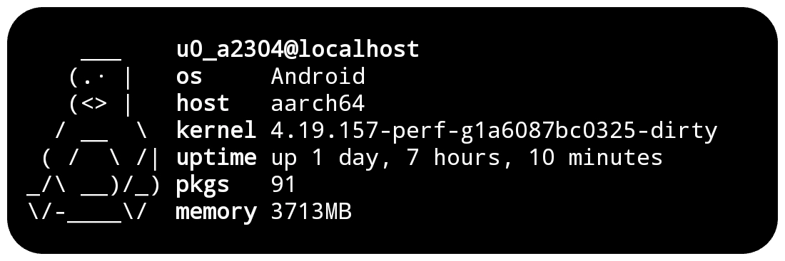

# tfetch🐧

A tiny system info script for [Termux](https://termux.dev), written in pure Bash.  
No dependencies. No noise. Just the essentials.



## Table of Contents

- [Features](#features)
- [Installation](#installation)
- [Usage](#usage)
- [Examples](#examples)
- [Uninstallation](#uninstallation)
- [Environment](#environment)
- [Contributing](#contributing)
- [License](#license)

## Features

- Displays basic system information:
  - Username and hostname
  - OS, architecture, kernel
  - Uptime, installed packages, memory
  - Current date and time
  - Color palette
- Works offline — no external dependencies
- Fast, lightweight, and silent on errors
- ASCII art included (tux and android)

## Installation

1. Clone the repository:
```bash
git clone https://github.com/haithamaouati/tfetch.git
```

2. Change to the tfetch directory:
```bash
cd tfetch
```

3. Install the script:
```bash
bash install.sh
```

## Usage

```bash
tfetch [OPTIONS]
```

### Options:

| Option | Long Form | Description |
|--------|-----------|-------------|
| `-c` | `--clear` | Clear the screen before displaying info |
| `-p` | `--palette` | Show the terminal color palette |
| `-t` | `--tux` | Use Tux ASCII art (default) |
| `-a` | `--android` | Use Android ASCII art |
| `-d` | `--datetime` | Show current date and time |
| `-h` | `--help` | Show this help message and exit |

### Examples

```bash
# Display system info with cleared screen and color palette
tfetch -c -p

# Show with Android ASCII art and datetime
tfetch -a -d

# Show with Tux art (default) and clear screen
tfetch -c

# Display help message
tfetch -h
```

### Make it a Startup Banner (Optional)

1. Open `~/.bashrc` using `nano`:
```bash
nano ~/.bashrc
```

2. Add the following line at the end of the file:
```bash
tfetch -c -p
```

3. Save and exit using `Ctrl` + `X`, then press `Y` and `Enter`

## Uninstallation

```bash
bash uninstall.sh
```

## Environment

- **Tested on:** [Termux](https://termux.dev/en/)
- **Required:** Bash 4.0+
- **No external dependencies**

## Contributing

Found a bug? Have a feature idea? Contributions are welcome! Feel free to:
- Open an [issue](https://github.com/haithamaouati/tfetch/issues)
- Submit a [pull request](https://github.com/haithamaouati/tfetch/pulls)

## Star History

[](https://www.star-history.com/#haithamaouati/tfetch&type=date&legend=top-left)

### Find this repository useful? ♥️

Support it by joining the [stargazers](https://github.com/haithamaouati/tfetch/stargazers). ⭐

If you want to help even more, please spread the word — share the project on X, Reddit, or with your community so more people discover it.

And [follow me](https://github.com/haithamaouati) to keep up with future updates and projects. 🤩

## License

**tfetch** is licensed under [WTFPL license](LICENSE)
